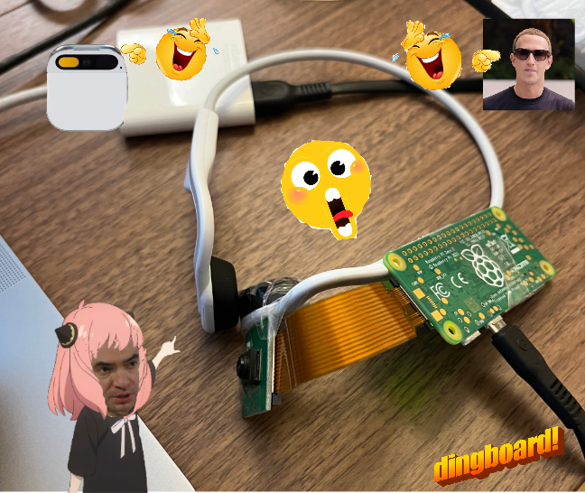

# wearable-gpt-experiment

### GPT4-Vision + [Raspberry Pi Zero 2](https://www.raspberrypi.com/products/raspberry-pi-zero-2-w/) + [Arducam OV5647](https://www.arducam.com/product/5mp-fisheye-camera-m8-mount-lens-raspberry-pi/)

Streams frames from the Pi to a remote server using sockets + [Picamera2 library](https://datasheets.raspberrypi.com/camera/picamera2-manual.pdf).

(Mounted on a pair of headphones here)

This code was only written for fun. Hope it gets someone out there a headstart.

-----

With ❤️ by [Ash](https://github.com/ashwinlokkur) and yours truly.